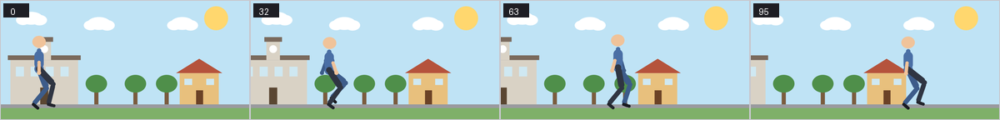

# glaxnimate-ai

**An MCP server that lets an LLM author real 2D cartoon animation.**

You say *"a man walks home from school"* and a language model produces an actual
animated scene — a walk cycle, a scrolling background, footsteps that land on the
right frames, and a line of dialogue — exported to Lottie, GIF or MP4 **with a
soundtrack**. Not a storyboard, not a prompt for a video model. A vector animation
you can open and edit in [Glaxnimate](https://glaxnimate.mattbas.org/).



---

## Why this isn't just "wrap Glaxnimate's API in tools"

Two facts drive the entire design, and ignoring either produces something that
doesn't work:

**1. An LLM cannot draw.** Ask a model to emit bezier coordinates for a human
figure and you get a mangled blob — it's placing points in a space it cannot see.
So the model never draws characters. It *parameterises* a procedural, rigged
cartoon library: it picks a body and a gait, and the library does the drawing.
Geometric scenery (a house is a rectangle and a triangle) it *can* draw, look at,
and fix — so it builds that directly.

**2. An LLM animating blind produces garbage — but most of the fix is arithmetic,
not vision.** Timing and spacing are the whole craft, and a model can't correct
what it can't perceive. So it gets a **four-tier critic stack, cheapest first**: a
free linter, numeric diagnostics, rendered images, and finally you. Images cost
~1,400 tokens each and only answer what numbers can't, so they're a last resort,
not the workhorse.

Both constraints generalise. The model can't hear either — so sound gets the same
treatment: SFX are JSON synth patches it *parameterises* rather than records, cue
placement is **derived from the animation's own physics**, and the first tier of
audio feedback is a numeric mix report, not a listen. See [Audio](#audio).

The MCP server is the smallest part of the codebase. The rig library and the
critic stack are the product.

---

## The v2 architecture: content is data, code is engine

The first version wired everything up as Python — every creature a function,
every scene a closure in memory, every frame a keyframe. It worked, and it did
not scale. v2 restructures around the same idea Spine uses:

```
ASSETS (JSON, validated, LLM-authorable)       SCENE (JSON, persisted per doc)
  *.body.json   joints/limbs/skins/slots         scenery · props · characters
  *.gait.json   phase tables + ratios            (sampled poses) · objects ·
  *.prop.json   declarative shapes               expression swaps · audio
  *.face.json   attachments per slot             (cues · music seed · dialogue)
  *.sfx.json    synth patches                            │
        └───────────────┬─────────────────────────────────┘
                        ▼  sample
              TIMELINE IR — plain per-frame world transforms
                        │
        ┌───────────────┼──────────────────┬─────────────────┐
        ▼               ▼                  ▼                 ▼
     critic        keyframe reducer    renderer         motion events
  (lint + diagnose  (semantic keys +  (frames, sheets,  (plants · hits ·
   run on data —     bezier fit)       GIF/MP4)          launches)
   balls and props        │                                  │
   included)              ▼                                  ▼
              sparse, editable output: one layer      foley: cues on the
              per bone, parented Spine-style,         exact frames, panned
              ~10 keys where v1 wrote ~200            to where they happen
```

What that buys, measured:

- **The vocabulary grows without code.** A new creature is a JSON document the
  model authors through `save_asset`, validated on load by the same checks the
  builtins pass (rig cycles, the gait reach guard). The acceptance test is a bird
  that exists nowhere in the Python — it loads, walks, and lints clean.
- **Output is 8.4× smaller and actually editable.** `walk_home` went from 2,332
  keyframes / 227 KB to 278 keyframes / 53 KB, with keys seeded at pose extremes
  and bezier easing fitted per segment. In the GUI it is a poseable puppet —
  rotate a thigh and the leg follows — instead of a per-frame wall.
- **Scenes survive.** Every session autosaves as `projects/<doc_id>/scene.json`
  (sampled poses, not code — exact by construction). Restart the server, ask for
  the same doc_id, get a byte-identical render.
- **Faces, as data.** Bodies carry slots; face assets carry swappable attachments
  (`happy`, `sad`, `surprised`, `blink`); `set_expression` hold-keys exactly one
  visible. The same face document reads correctly on an upright human head and a
  tilted dog head.
- **One thread owns Qt.** The MCP event loop stays responsive during renders and
  scripts; every Qt object only ever sees the worker thread.
- **Sound is on the same document.** Cues, a music seed and dialogue live in the
  scene JSON; TTS renders cache beside it as WAVs, so a reloaded scene speaks its
  lines with no synthesizer installed — samples persisted, not the program that
  made them.

---

## What it can animate

The core abstraction is **a rig is a graph of joints; a gait is a table of
phase-offset limb cycles.** A human is one preset among many — not the design
centre.

| | |
|---|---|
| **Bodies** | `human` / `biped`, `quadruped` (dog, cat, horse), extensible |
| **Gaits** | `walk`, `run`, `trot`, `gallop`, `bound`, `hop` — one engine, a phase table per animal |
| **Non-character motion** | `bounce`, `roll` (no-slip wheel), `spring`, `drift` (falling leaf), `sway` |
| **Principles** | ease in/out, anticipation, overshoot, arcs (squash-and-stretch computes correctly but does not yet reach the render — see below) |
| **Scenery** | sky, ground, house, school, tree, cloud, sun, parallax at any depth |
| **Sound** | 9 synth SFX patches, foley derived from the motion, seeded chiptune music, neural-TTS dialogue with speech bubbles |
| **Exports** | Lottie JSON, MP4 · WebM (both with the soundtrack muxed in), WebP, animated GIF, SVG, PNG spritesheet, `.rawr` |

Feet do not slip: legs are solved with inverse kinematics from a fixed foot
target, so a planted foot is world-stationary *by construction*, and the linter
verifies it rather than chasing it. One engine drives a walking man, a trotting
dog and a bouncing ball with mathematically zero contact slip.

> **Known bug: squash-and-stretch does not render.** `principles.squash_stretch`
> computes the right numbers and `motion.bounce` asks for them, but they are
> written to `transform.scale`, which **cannot be written through the Glaxnimate
> bindings at all** — every type silently no-ops (measured: a ball whose maths
> wants `scale.y=0.79` renders 80x80 on every frame). Props scale correctly
> because `draw_prop` scales coordinates instead. The fix is to animate the
> shape's `size` channel, which does work; until then a bouncing ball keeps a
> rigid outline. See `docs/glaxnimate-api.md`.

---

## Installing

**You must build Glaxnimate from source.** The `glaxnimate` PyPI wheel is unusable
outside openSUSE — it's compiled against SUSE's patched ffmpeg and demands symbols
(`LIBAVCODEC_61.19_SUSE`) that no other ffmpeg exports. Building against your own
system's Qt6/KF6/ffmpeg removes the problem entirely, and yields both the GUI app
and working Python bindings.

Tested on **Ubuntu 26.04** with **Python 3.14**. Other Debian-family distros with
Qt6 and KDE Frameworks 6 should work; adjust package names as needed.

```sh
git clone git@github.com:thimbleberrysystems/glaxnimate-ai.git
cd glaxnimate-ai

# 1. Build the engine (installs deps via apt; needs sudo; ~15 min compile)
bash scripts/setup.sh

# 2. Create the project venv and install
uv venv --python /usr/bin/python3 .venv
uv pip install --python .venv/bin/python -e .
# link the source-built bindings into the venv (setup.sh prints the exact path)
ln -sf ~/src/glaxnimate/build/bin/plugin/python/build/lib/glaxnimate.cpython-314-*.so \
    .venv/lib/python3.14/site-packages/

# 3. Verify
.venv/bin/python -m pytest -q          # 126 tests, ~10s
```

**Dialogue is opt-in.** SFX, music and muxing work out of the box (numpy and PyAV
are core deps — PyAV bundles its own ffmpeg, so there's no system binary to
install and nothing that can clash with the Glaxnimate build's libav). TTS pulls
onnxruntime, so it lives behind an extra:

```sh
uv pip install --python .venv/bin/python -e '.[tts]'
.venv/bin/python -m piper.download_voices en_US-lessac-medium --data-dir assets/voices
```

You need it to *author* a spoken line; a scene replays cached dialogue without it.

`setup.sh` builds the GUI app to `/usr/local/bin/glaxnimate` too, so you can open
and hand-edit anything the model produces.

> **macOS / Windows:** the pose engine and critic stack are pure Python and run
> anywhere, but the Glaxnimate *renderer* is Linux-tested here. On other platforms,
> [build Glaxnimate from its own instructions](https://glaxnimate.mattbas.org/contributing/building/)
> and point the venv at the resulting `glaxnimate` module. WSL2 on Windows works
> exactly like Ubuntu.

---

## Connecting an LLM

The server speaks the [Model Context Protocol](https://modelcontextprotocol.io),
so any MCP-capable client can drive it. The command is always:

```
/home/YOU/glaxnimate-ai/.venv/bin/python -m glaxnimate_ai.mcp.server
```

### Claude Code (CLI)

```sh
claude mcp add glaxnimate -- \
    /home/YOU/glaxnimate-ai/.venv/bin/python -m glaxnimate_ai.mcp.server
```

Then just ask: *"animate a man walking home from school."*

### Claude Desktop

Edit `claude_desktop_config.json` (Settings → Developer → Edit Config):

```json
{
  "mcpServers": {
    "glaxnimate": {
      "command": "/home/YOU/glaxnimate-ai/.venv/bin/python",
      "args": ["-m", "glaxnimate_ai.mcp.server"]
    }
  }
}
```

Restart Claude Desktop; the tools appear under the 🔌 icon.

### Cursor / Windsurf / other MCP-native editors

Add to the editor's MCP config (Cursor: `.cursor/mcp.json`):

```json
{
  "mcpServers": {
    "glaxnimate": {
      "command": "/home/YOU/glaxnimate-ai/.venv/bin/python",
      "args": ["-m", "glaxnimate_ai.mcp.server"]
    }
  }
}
```

### Any model via the Claude / OpenAI Agents SDK, LangChain, etc.

The server is a standard stdio MCP server, so any framework with an MCP client
adapter can use it — Anthropic's SDK (`mcp_servers`), OpenAI's Agents SDK MCP
support, LangChain's `langchain-mcp-adapters`, LlamaIndex, and so on. Point the
adapter at the same command above. The tools are model-agnostic; the *quality* of
the result depends on the model's spatial and timing judgment, which is what the
critic stack is there to backstop.

### No LLM at all

The library is a perfectly good scriptable animation toolkit on its own:

```sh
.venv/bin/python examples/walk_home_from_school.py
.venv/bin/python examples/bouncing_ball.py
.venv/bin/python examples/how_magnets_work.py   # a 71s narrated science explainer
```

`how_magnets_work.py` is the other end of the range: no walk cycle, six shots on
one timeline, and an explanation carried entirely by the narration — the bindings
expose no text shape, so the film cannot draw a single label. It is also where
`motion.attract` came from. The intuitive primitive for "two magnets snap
together" was `spring()`, which is elastic: it pulls hardest when *far* away, so
it lunges early and overshoots (measured: 112% of a 300px trip covered by frame
5). Magnets do the opposite — nothing at range, then a violent last centimetre,
then a clack. That late snatch is the whole effect, and it is `1/r^n`, not a
spring.

---

## How the model uses it — the loop

The tools are ordered so the cheap tiers come first, and their descriptions push
the model down the ladder:

```
new_document → run_script → lint_animation → diagnose_animation → (render) → auto_sfx → export
                  build       is it BROKEN?    is it GOOD?          LOOK    sound_report deliver
                              free             ~500 tokens        ~1400 tok    free
```

A representative script the model writes with `run_script`:

```python
man = human()
walk = make_gait(man, "walk", cycle_frames=24)
add_character(man, walk, x=90, name="man", face="human")

ball = motion.bounce(x0=60, x1=880, ground_y=ground,
                     apex=220, frames=frames, bounces=5)
add_object(ball, color="#e8543f")

auto_sfx()                       # footsteps + boings, from the motion itself
music(seed=11, bpm=104, gain=0.18)
say("man", "What a lovely day to walk home!", 20)
```

It never draws the man — it picks a body and a gait. Then it runs
`lint_animation` (free — catches sliding feet, unreachable legs, feet through the
floor) and `diagnose_animation` (spacing charts, arc quality, balance, silhouette;
names the exact frame). Only for questions numbers can't answer — *does this read
as a character? is the composition any good?* — does it render an image.
`sound_report` checks the mix the same way, as numbers. Finally
`preview_for_human` hands **you** a GIF (and an MP4 with sound), because your one
sentence of feedback ("legs too stiff") is the highest-signal input in the whole
system.

### The 21 tools

| Tool | Tier | Purpose |
|---|---|---|
| `new_document` | build | start a scene → `doc_id` |
| `run_script` | build | run Python against the cartoon library (the workhorse) |
| `cartoon_api` | build | dump the library's vocabulary |
| `describe_scene` | build | the scene as readable data (scenes persist across restarts) |
| `lint_animation` | 0 · free | is it broken? contact slip, joints, bounds, strobing |
| `diagnose_animation` | 1 · ~500 tok | is it good? spacing, arcs, balance, silhouette |
| `render_contact_sheet` | 2 · image | whole motion as one numbered grid |
| `render_frame` | 2 · image | one frame, full size |
| `render_motion_trail` | 2 · image | onion-skin, for checking arcs |
| `auto_sfx` | sound | the foley pass: cues derived from the motion itself |
| `add_sound` | sound | one manual cue (builtin patch or saved sfx asset) |
| `say` | sound | a character speaks — local neural TTS + speech bubble |
| `sound_report` | 0 · free | the mix as numbers: cue sheet, peak dBFS, pile-ups |
| `save_asset` / `load_asset` / `list_assets` | assets | grow the vocabulary: creatures, gaits, props, faces, sounds as JSON |
| `export` | output | Lottie · MP4 (+audio) · WebM (+audio) · WebP · GIF · SVG · PNG · rawr |
| `preview_for_human` | 4 · human | write a GIF for you to watch (plus an MP4 with sound when audio exists) |
| `open_in_gui` | gui | open the scene in Glaxnimate |
| `gui_live_run` / `gui_live_status` | gui | edit a *running* Glaxnimate window live |

---

## Audio

Exports aren't silent. Sound follows the same rule as everything else here —
**content is data, code is engine** — and the same critic ethos: numbers before
ears.

**Sound effects are synth patches, not sample files.** Classic cartoon SFX were
physically synthesized in the first place (springs, slide whistles, pitch
sweeps), so an `sfx` asset is a small JSON patch — oscillator, pitch sweep,
envelope — rendered deterministically. Nine ship built in (`boing`, `thud`,
`step`, `pop`, `whoosh`, `slide_up`, `slide_down`, `splat`, `ding`); the model
authors new ones with `save_asset` and cues them by name. No licenses, no
downloads, and a patch is something a model can *iterate on* like a body or a
face.

**Placement is derived, not guessed.** The Timeline IR already computes — for
the linter — exactly the physical facts a foley artist works from: when a foot
plants, when a ball meets the ground, when a body goes airborne. `auto_sfx`
turns those events into cues on the right frames, panned to where they happen
on screen. The same walk that lints clean gets its footsteps for free.

**Music is a seeded chiptune bed.** `music(seed=7, bpm=104)` renders a square-wave
melody on a major pentatonic over a I–V–vi–IV bass — the register the visuals
already live in. Deterministic per seed: if it sounds naff, change the seed.
It's a data field in the scene document, not a composition system.

**Dialogue is local neural TTS** ([piper](https://github.com/OHF-Voice/piper1-gpl)).
`say("man", "What a lovely day!", frame=20)` synthesizes the line, holds a
speech bubble above the speaker for its duration, and **caches the rendered
audio inside the project directory** — a scene replays its dialogue forever
without piper installed, the same persist-the-samples rule the document uses
for poses. It's the `[tts]` extra plus a one-off voice download (~60 MB):

```bash
uv pip install --python .venv/bin/python -e '.[tts]'
.venv/bin/python -m piper.download_voices en_US-lessac-medium --data-dir assets/voices
```

Skip both and everything else still works; `say` then fails with the command you
need rather than an import traceback.

**The model cannot hear — and the tier ladder already covers that.**
`sound_report` is tier 0 for audio: the cue sheet, peak dBFS, clipping count
(always 0 — the bus runs through a soft limiter), and warnings when cues pile
up. The human ear is the top tier: when a scene has audio, `preview_for_human`
writes an MP4 with the soundtrack next to the GIF, and `export` to MP4/WebM
muxes the mix in automatically (PyAV — no system ffmpeg, no re-encode of the
video stream).

Honest limits: the model never hears its own output (the numeric report and
your ears close that loop); the music generator is deliberately simple; piper
needs network once per voice, then everything is offline.

---

## Live GUI bridge (optional)

Edit the document you're *watching*, in real time.

```sh
bash scripts/install_plugin.sh      # installs the plugin + python3-pyqt6 (sudo)
```

Then in Glaxnimate: **Plugins → Start AI Bridge**. The app listens on
`127.0.0.1:9123`; `gui_live_run` edits the open document and the canvas updates
immediately. Every AI edit is a single undo step, so `Ctrl+Z` always puts it back.

Two design choices make this safe (both obvious alternatives are wrong): it uses
`QTcpServer`, whose signals Qt delivers on the **main thread**, so edits never
touch Qt from the wrong thread; and it uses **PyQt6 from apt**, which binds the
same system Qt the app already loaded, rather than pip's PySide6 which would drag a
second Qt into the process.

---

## Development

```sh
.venv/bin/python -m pytest -q          # 126 tests, ~10s
.venv/bin/ruff check src tests examples

# end-to-end check of the live bridge (needs system PyQt6 + built module):
MOD=~/src/glaxnimate/build/bin/plugin/python/build/lib
PYTHONPATH="$MOD:src" QT_QPA_PLATFORM=offscreen python3 scripts/check_bridge.py
```

The pose engine is pure Python and knows nothing about Glaxnimate — `engine/bake.py`
is the only seam between them. That's why the tests and the critic run in half a
second with no Qt in the room.

Every critic check is tested against faults planted on purpose — a sliding foot, a
leg on stilts, a NaN, a zigzag arc, a figure bent double, a deliberately clipped
mix. A linter that only ever passes protects nothing.

The audio tests run with `GLAXNIMATE_AI_TTS_STUB=1`, which swaps synthesis for
deterministic beeps: the suite must never depend on a 60 MB voice model, and what
is under test is caching, mixing and persistence — not piper's acoustics, which
aren't ours to test.

```
src/glaxnimate_ai/
  cartoon/    rig · gait · motion · principles · presets · geometry · assets  (pure Python)
  engine/     session · scene_doc · bake · reduce · props · live
  feedback/   lint · diagnose · render
  audio/      synth · events · mix · music · voice · mux
  mcp/        server
plugin/AiBridge/    the live GUI plugin
docs/glaxnimate-api.md   the REAL bindings API (the online docs are a version behind)
```

---

## License

MIT. Glaxnimate itself is GPL-3.0; this project drives it via its Python bindings
and does not redistribute it.
